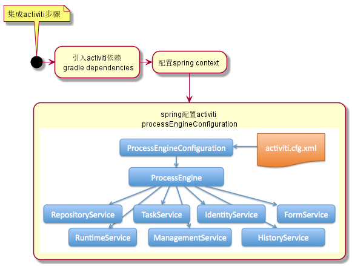

# ACTIVITI - EXMAPLE 集成开发示例

**简介：**

> Activiti is battle-tested Business Process Management.

> Activiti 是一个久经实战的业务工作流管理器

为了更好的理解ACTIVITI，我编写了

- [《ACTIVITI 简明教程》](./doc-activiti.md)
- [《ACTIVITI BPMN2.0 示例说明》](./doc-activiti-bpmn.md)

在进入实际开发之前，请先阅读以上内容。

## 集成步骤

通常我们会将ACTIVITI与SPRING一起使用 ~



**1. 引入activiti依赖**

gradle :

```gradle
// activiti dependency
compile 'org.activiti:activiti-engine:5.22.0' //核心
compile 'org.activiti:activiti-bpmn-layout:5.22.0'
compile 'org.activiti:activiti-spring:5.22.0'
compile 'org.activiti:activiti-rest:5.22.0'
//...更多
```

**2. 配置spring context添加activiti相关的bean**

```xml
<bean id="processEngineConfiguration" class="org.activiti.spring.SpringProcessEngineConfiguration">
    <property name="dataSource" ref="dataSource" /> <!--引入数据源-->
    <property name="transactionManager" ref="transactionManager" /> <!--引入事务管理-->
    <property name="databaseSchemaUpdate" value="true" /><!-- 自动建表，自动更新表结构 -->
    <property name="deploymentResources"  value="classpath*:/autodeploy/*.bpmn20.xml" /> <!--自动导入-->
    <!--......更多配置-->
</bean>
<bean id="processEngine" class="org.activiti.spring.ProcessEngineFactoryBean">
    <property name="processEngineConfiguration" ref="processEngineConfiguration" />
</bean>
<bean id="repositoryService" factory-bean="processEngine" factory-method="getRepositoryService" />
<bean id="runtimeService" factory-bean="processEngine" factory-method="getRuntimeService" />
<bean id="taskService" factory-bean="processEngine" factory-method="getTaskService" />
<bean id="historyService" factory-bean="processEngine" factory-method="getHistoryService" />
<bean id="managementService" factory-bean="processEngine" factory-method="getManagementService" />
```

**3. 使用activiti相应的service开发对应的功能**

使用junit测试各个service

通过Spring @Autowired 注入需要的Service

```java
@Autowired
ProcessEngine processEngine;
@Autowired
RepositoryService repositoryService;
@Autowired
RuntimeService runtimeService;
@Autowired
TaskService taskService;
@Autowired
HistoryService historyService;
```

### RepositoryService 测试

> RepositoryService的主要作用是管理流程仓库，例如部署，删除，读取流程资源等。

`RepositoryService`提供了对于规则的管理功能，具体的功能列表请参考：[https://www.activiti.org/javadocs/org/activiti/engine/RepositoryService.html](https://www.activiti.org/javadocs/org/activiti/engine/RepositoryService.html)

**发布一个由BPMN2.0规则文件定义的处理流程规则**

```java
@Test
public void deployTest() {
    Deployment dp = repositoryService.createDeployment().addClasspathResource("ask-for-vacation.bpmn20.xml").deploy();
    System.out.println(JSON.toJSONString(dp));
    System.out.println(String.format("name=%s,id=%s,category=%s,deploytime=%s,tenantid=%s",dp.getName(),dp.getId(),dp.getCategory(),dp.getDeploymentTime(),dp.getTenantId()));
}
```


**测试查询已发布的规则**

```java
@Test
public void repositorQueryTest(){
    ProcessDefinitionQuery query = repositoryService.createProcessDefinitionQuery();
    System.out.println("已有规则总数："+query.count());
    //查询所有已发布的流程规则
    List<ProcessDefinition> list = query.list();
    for(ProcessDefinition pd:list){
        System.out.println(String.format("\n规则名称：%s\nID\t= %s\nKEY\t= %s\nDEPLOYMENT_ID\t= %s",pd.getName(),pd.getId(),pd.getKey(),pd.getDeploymentId()));
    }
}
```


以上代码输出：

```
已有规则总数：1

规则名称：Vacation request
ID	 = vacationRequest:1:cd2c3c0d817a47049377afd09a47a868
KEY	 = vacationRequest
DEPLOYMENT_ID = ee9d0c040ef04ca8bde4cd63432672f7
```

### RuntimeService 测试

> RuntimeService 主要用于管理流程在运行时产生的数据(流程参数，事件，流程实例，以及执行流)以及对正在运行的流程进行操作的API。

`RepositoryService` 功能列表请参考：[https://www.activiti.org/javadocs/org/activiti/engine/RuntimeService.html](https://www.activiti.org/javadocs/org/activiti/engine/RuntimeService.html)


**我们如何根据已有的规则，创建一个工单？**

所以当我们需要创建工单时便会使用到`RuntimeService`，以下代码为使用`process key `创建工单实例：

```java
@Test
public void runtimeServiceTest(){
    String processId = "vacationRequest:1:cd2c3c0d817a47049377afd09a47a868";
    String processKey = "vacationRequest";
    //ProcessInstance instance = runtimeService.startProcessInstanceById(processId);
    //ProcessInstance instance = runtimeService.startProcessInstanceByKey(processKey);
    //1. 定义初始化流程变量
    Map<String, Object> variables = new HashMap<String, Object>();
    variables.put("employeeName", "Dennis");
    variables.put("numberOfDays", 4);
    variables.put("vacationMotivation", "世界那么大我想去看看~！");
    //2. 使用process key 创建实例
    ProcessInstance processInstance = runtimeService.startProcessInstanceByKey(processKey, variables);
    //3. 查看所有运行中的工单
    System.out.println("运行中的所有工单（实例）: " + runtimeService.createProcessInstanceQuery().count());
}
```

以上方法便会产生一条对应`vacationRequest`这个流程的记录，在工作流中，可称为创建了`工单`。

其中`variables`值对应的就是创建这个工单时候对应的表单变量。

**查询某个规则所有的运行所有实例（所有工单）**

```java
@Test
public void runtimeServiceQueryTest(){
    String processKey = "vacationRequest";
    List<ProcessInstance> list = runtimeService.createProcessInstanceQuery().processDefinitionKey(processKey).list();
    for(ProcessInstance instance: list){
        System.out.println(String.format("ID:%s\nDeploy_id：%s\nProcessDefinitionKey:%s\n",instance.getId(),instance.getDeploymentId(),instance.getProcessDefinitionKey()));
    }
}
```

**流程的挂起和激活**

```java
@Test
public void suspendAndActivateTest(){
    String processInstanceId = "10076e30b5914f0eb19a0a41d04fa588";
    ProcessInstance processInstance = runtimeService.createProcessInstanceQuery().processInstanceId(processInstanceId).singleResult();
    System.out.println("流程是否挂起："+processInstance.isSuspended());
    //挂起流程实例
    runtimeService.suspendProcessInstanceById(processInstanceId);
    //验证是否挂起
    System.out.println("流程是否挂起："+runtimeService.createProcessInstanceQuery().processInstanceId(processInstanceId).singleResult().isSuspended());
    //激活流程实例
    runtimeService.activateProcessInstanceById(processInstanceId);
    //验证是否激活
    System.out.println("流程是否激活："+!runtimeService.createProcessInstanceQuery().processInstanceId(processInstanceId).singleResult().isSuspended());
}
```

### TaskService 测试

提供对任务和表单相关操作的访问的服务。功能列表请参考：[https://www.activiti.org/javadocs/org/activiti/engine/TaskService.html](https://www.activiti.org/javadocs/org/activiti/engine/TaskService.html)

**查询Task任务**

```java
List<Task> list = taskService.createTaskQuery().list();
```
- 其中`createTaskQuery()`创建的`TaskQuery`对象支持丰富的查询方式，详细API请参考：[https://www.activiti.org/javadocs/org/activiti/engine/task/TaskQuery.html](https://www.activiti.org/javadocs/org/activiti/engine/task/TaskQuery.html)

常用的查询有：

1.根据表单变量作为调节查询

```java
@Test
public void taskQueryByVariableTest() {
    String name = "Sclla";
    Task t = taskService.createTaskQuery().processVariableValueEquals("employeeName",name).singleResult();
    printTask(t);
    Map<String,Object> variables = taskService.getVariables(t.getId());
    System.out.println("任务变量："+JSON.toJSONString(variables));
}
```

2.根据`Task`在bpmn20.xml中定义的`ID`查询，及通过`TaskDefinitionKey`查询

```java
@Test
public void taskQueryByDefinitionKeyTest() {
    String taskDefinitionKey = "handleRequest";
    List<Task> list = taskService.createTaskQuery().taskDefinitionKey(taskDefinitionKey).list();
    for(Task t:list){
        printTask(t);
    }
}
```

3.完成具体任务

```java
@Test
public void taskCompleteTest() {
    String taskId = "fadfb5b627814d82b44c48e74c34560c";
    Map<String,Object> variable = new HashMap<String, Object>();
    variable.put("vacationApproved",true);
    variable.put("managerMotivation","去吧，看看世界也好，才知道还是这里好。");
    taskService.complete(taskId,variable);

    taskQueryTest();
}
```

### FormService 测试

> 访问表单数据和呈现的表单，用于启动新的处理实例和完成任务

具体API列表，详见：[https://www.activiti.org/javadocs/org/activiti/engine/FormService.html](https://www.activiti.org/javadocs/org/activiti/engine/FormService.html)

**获取流程启动节点表单**

根据流程规则定义的ID，查询启动任务所需的表单项。
通常我们在创建工单的时候是需要先知道必须的表单变量，如果数据需要前端填写，则需要根据对于的`FormData`创建表单界面，用于录入数据。
```java
@Test
public void formTest() {
    String processDefinitionId = "vacationRequest:1:cd2c3c0d817a47049377afd09a47a868";
    StartFormData startFormData = formService.getStartFormData(processDefinitionId);
    List<FormProperty> list = startFormData.getFormProperties();
    for(FormProperty fp:list){
        System.out.println(JSON.toJSONString(fp));
    }
}
```
输出结果：

```json
{"id":"numberOfDays","name":"Number of days","readable":true,"required":true,"type":{"mimeType":"plain/text","name":"long"},"writable":true}
{"id":"startDate","name":"First day of holiday (dd-MM-yyy)","readable":true,"required":true,"type":{"name":"date"},"writable":true}
{"id":"vacationMotivation","name":"Motivation","readable":true,"required":false,"type":{"mimeType":"text/plain","name":"string"},"writable":true}
```

**获取用户任务节点表单**

根据`Task.getId()`取到的ID查询该任务完成所需的`FormData`:
```java
@Test
public void formTaskTest() {
    String taskId = "5f153afe19c94161a70c657cb9510811";
    FormData data = formService.getTaskFormData(taskId);
    List<FormProperty> list = data.getFormProperties();
    for(FormProperty fp:list){
        System.out.println(JSON.toJSONString(fp));
    }
}
```

输出结果：

```json
{"id":"vacationApproved","name":"Do you approve this vacation","readable":true,"required":true,"type":{"name":"enum"},"writable":true}
{"id":"managerMotivation","name":"Motivation","readable":true,"required":false,"type":{"mimeType":"text/plain","name":"string"},"writable":true}
```

**自定义表单类型**

> 所有自定义的表单字段都需要继承一个表达类型抽象类`org.activiti.engine.form.AbstractFormType`

```java
public class UsersFormType extends AbstractFormType {

    /**
     * 把字符串的值转换为集合对象
     * @param propertyValue
     * @return
     */
    @Override
    public Object convertFormValueToModelValue(String propertyValue) {
        String[] split = StringUtils.split(propertyValue, ",");
        return Arrays.asList(split);
    }

    /**
     * 把集合对象的值转换为字符串
     * @param modelValue
     * @return
     */
    @Override
    public String convertModelValueToFormValue(Object modelValue) {
        if(modelValue==null){
            return null;
        }
        return modelValue.toString();
    }

  /**
     * 定义表单类型的标识符
     * @return
     */
    public String getName() {
        return "users";
    }
}
```

要使用自定义类型，需要在`processEngineConfiguration`中配置自定义类型作为参数
```xml
<bean id="processEngineConfiguration" class="org.activiti.spring.SpringProcessEngineConfiguration">
  ......
  <!-- 自定义表单字段类型 -->
    <property name="customFormTypes">
        <list>
            <bean class="cn.geobeans.activiti.common.type.UsersFormType"/>
        </list>
    </property>

</bean>
```


### IdentityService 测试

> Service to manage Users and Groups.

> 在Activiti中内置了一套简单的对用户和用户组的支持，用于满足基本的业务需求。`org.activiti.engine.identity`该包用来进行身份管理和认证，其功能依托于`IdentityService`接口。

具体API列表，请详见：[https://www.activiti.org/javadocs/org/activiti/engine/IdentityService.html](https://www.activiti.org/javadocs/org/activiti/engine/IdentityService.html)

**说明**:

通常我们在使用activiti进行流程管理的时候，如果需要将工单和具体用户进行绑定，这需要使用到`IdentityService`配置对应的`Task`.

但是，它并不是必须的，如果不使用`IdentityService`,我们也可以直接通过流程规则定义中的`ID`或者`KEY`来查询和管理相应任务。

**用户管理**

- 创建用户 `IdentityService.newUser`
- 删除用户 `IdentityService.deleteUser`

```java
@Test
public void testUser() {
    User user = identityService.newUser("Jonathan");
    user.setFirstName("Jonathan");
    user.setLastName("chang");
    user.setEmail("whatlookingfor@gmail.com");
    user.setPassword("123");
    //保存用户到数据库
    identityService.saveUser(user);
    //用户的查询
    User userInDb = identityService.createUserQuery().userId("Jonathan").singleResult();
    System.out.println("用户查询结果："+JSON.toJSONString(userInDb));
    //验证用户名和密码
    System.out.println("验证用户密码："+identityService.checkPassword("Jonathan","123"));

    //删除用户
    identityService.deleteUser("Jonathan");
    //验证是否删除成功
    userInDb = identityService.createUserQuery().userId("Jonathan").singleResult();
    System.out.println("用户是否删除成功："+(userInDb==null));
}
```


**用户组管理**

- 创建用户组 `IdentityService.newGroup`
- 删除用户组 `IdentityService.deleteGroup`

```java
@Test
public void testGroup(){
    //创建用户组对象
    Group group = identityService.newGroup("hr");
    group.setName("hr用户组");
    group.setType("assignment");
    //保存用户组
    identityService.saveGroup(group);
    //验证是否保存成功
    Group groupInDb = identityService.createGroupQuery().groupId("hr").singleResult();
    System.out.println("查询用户组："+groupInDb);
    //删除用户组
    identityService.deleteGroup("hr");
    //验证是否删除成功
    groupInDb = identityService.createGroupQuery().groupId("hr").singleResult();
    System.out.println("删除用户组："+(groupInDb == null));
}
```

**管理用户组合用户关系**

- 建立关系`IdentityService.createMembership`
- 删除管理`IdentityService.deleteMembership`

```java
@Test
public void testUserAndGroupMemership() {
    // Group groupInDb = identityService.createGroupQuery().groupId("hr").singleResult();
    // User userInDb = identityService.createUserQuery().userId("Jonathan").singleResult();
    createUser();
    createGroup();
    //将用户Jonathan加入到用户组hr中
    identityService.createMembership("Jonathan", "hr");
    //查询属于HR用户组的用户
    List<User> userInGroup = identityService.createUserQuery().memberOfGroup("hr").list();
    System.out.println("用户组hr中的用户有：");
    for (User u : userInGroup) {
        System.out.println(JSON.toJSONString(u));
    }
    //查询用户所属组
    List<Group> groupContainsUser = identityService.createGroupQuery().groupMember("Jonathan").list();
    System.out.println("用户Jonathan所在的用户组有：");
    for (Group g : groupContainsUser) {
        System.out.println(String.format("用户组：name=%s , type=%s", g.getName(), g.getType()));
    }
}
```